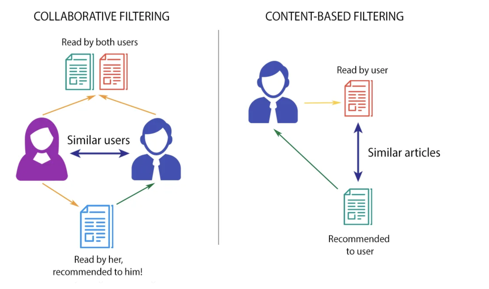
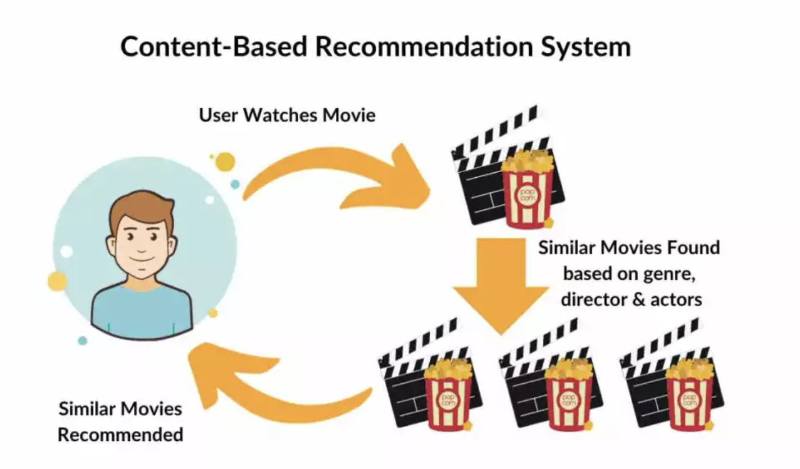

# **Hybrid Recommender System for Enhanced User Experience**

## Overview
In modern recommender systems, leveraging user feedback is crucial for improving recommendation quality and enhancing user satisfaction. Feedback data can be broadly classified into two types: **explicit feedback** (e.g., ratings and likes) and **implicit feedback** (e.g., clicks and purchase history). While explicit feedback provides direct insight into user preferences, implicit feedback is inferred from user interactions and can be valuable in understanding underlying interests.

This project addresses the challenges associated with both types of feedback, with careful handling of missing values: avoiding interpretation of missing explicit feedback as zeros, which could misrepresent user sentiments, while treating zeros in implicit feedback as a lack of interest.

## Challenges and Goals
One of the significant challenges in building effective recommendation models is the **sparsity** of user ratings, which hinders the performance of traditional algorithms like K-Nearest Neighbors (KNN). Beyond accuracy, additional evaluation metrics such as **diversity** and **serendipity** are critical for engaging users by offering varied and occasionally unexpected recommendations.

This project aims to develop a hybrid recommender system that combines content-based and collaborative filtering approaches through a meta-level strategy. Our main objective is to compare the effectiveness of **Singular Value Decomposition (SVD)** against the proposed meta-level hybrid approach. This system will leverage movie details from IMDb to group users by content-based similarity and apply collaborative filtering for prediction.

## Diagrams
To visualize the approach taken in this project, please see the diagrams below:

### Collaborative Filtering Diagram

### Content-Based Filtering Diagram

## Methodology: Collaboration via Content
Our "collaboration via content" strategy integrates content features to identify similar users, bridging the gap where collaborative filtering alone may fall short due to sparse data. By grouping users with similar interests based on content data, we enhance traditional collaborative filtering techniques. This approach is particularly effective for recommending movies within specific genres and can extend to diverse industries, supporting businesses in encouraging users to explore new products and services. In this project, it will utilize both recommender system to enhance performance.

## Key Features
- **Explicit and Implicit Feedback Integration**: Handles explicit feedback for precise user preferences and implicit feedback to infer potential interests.
- **Diversity and Serendipity**: Provides varied and unexpected recommendations to improve user engagement.
- **Meta-Level Hybrid Approach**: Combines the strengths of content-based filtering and collaborative filtering for more accurate predictions.
- **Comparison with SVD**: Evaluates the performance of the hybrid system against a standard SVD approach, highlighting the benefits of the hybrid model in sparse data environments.

## Potential Applications
While this recommender system focuses on movie recommendations, the methods developed here can be generalized for various industries seeking to drive product discovery and engagement, particularly during growth phases or product launches.

## References:
- Aggarwal, C. C. (2016). Recommender systems: The textbook. Springer.
- Desai U. (2023 Apr 27). Recommendation Systems Explained: Understanding the Basic to Advance. Medium.

